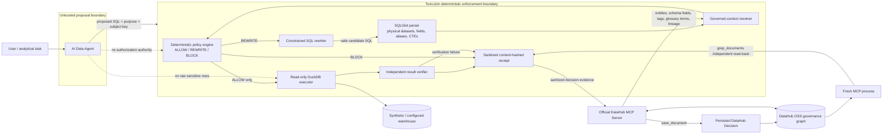

# ToxicJoin Architecture and Trust Boundaries

ToxicJoin is an enforcement boundary between an AI data agent and analytical execution. The agent may propose work, but it never owns authorization.



## Trust model

### AI agent: proposal authority only

The AI agent may formulate an analytical purpose and propose SQL. ToxicJoin treats that proposal as untrusted input. An LLM never decides whether the request is allowed, never weakens a policy to make a query run, and is not given raw sensitive result rows.

### DataHub: governed source of context

ToxicJoin resolves the physical fields referenced by the SQL and grounds them in governed DataHub context. The stable live integration uses DataHub OSS and the official DataHub MCP Server to read entities, schema fields, tags, glossary terms, and lineage.

Missing, conflicting, unclassified, or structurally invalid governed context is uncertainty, not permission. ToxicJoin fails closed.

The separate [governance-dependency evaluation](evidence/governance-dependency.md) holds the SQL, data, subject key, policy, and executor fixed while changing only normalized governance. Complete governance produces the intended `REWRITE → ALLOW` path; degraded governance blocks before execution.

### Deterministic policy: authorization authority

The policy engine is the only component that can produce an effective `ALLOW`. Its relevant interactions include:

- direct identifier + sensitive attribute;
- stable pseudonym + multiple quasi-identifiers + sensitive attribute;
- sensitive grouped results without a trusted minimum distinct-subject threshold;
- missing or ambiguous metadata and unsupported SQL.

`BLOCK` outranks `REWRITE` and `ALLOW`.

The [compositional ablation](evidence/compositional-ablation.md) isolates the cross-column interaction on the declared evaluation: the shipped policy blocks all 144 unsafe mutations, while the targeted interaction ablation allows those same 144 cases and preserves all 20 ALLOW/REWRITE controls.

### Rewrite: candidate transformation, never trusted output

A supported rewrite may add or strengthen a minimum distinct-subject condition to an already grouped analytical query. Generated SQL is not trusted because ToxicJoin created it.

The rewritten SQL must pass the same boundary again:

```text
rewrite
  → parse again
  → resolve governed context again
  → evaluate deterministic policy again
  → require effective ALLOW
```

Only then can execution be attempted.

### Execution and verification

DuckDB runs through a hardened read-only path. `BLOCK` and unresolved `REWRITE` requests do not reach the executor.

After execution, an independent verifier checks the accepted output contract, including required subject counts and forbidden output fields. Verification failure is fail-closed.

The [144-case adversarial mutation suite](evidence/adversarial-mutations.md) additionally requires every unsafe mutation to reach the intended compositional-risk rule and verifies that none reaches database execution.

### Receipts and DataHub institutional memory

Every path produces a sanitized, content-hashed receipt. Result rows are deliberately excluded so the audit artifact does not become another privacy leak.

When DataHub write-back is enabled, ToxicJoin persists a sanitized `Decision` through `save_document`. Persistence is not trusted from the write response alone: the writing MCP process is closed, a fresh MCP process is started, and `grep_documents` independently verifies the persisted decision marker.

The real SDK/MCP proof is retained in [live DataHub evidence](evidence/datahub-live.md).

## Agent and Skill representation in DataHub

ToxicJoin also has a reusable git-backed [Compositional Risk Review Agent Skill](../skills/compositional-risk-review/SKILL.md). In isolated DataHub development-channel evidence, the project registered and independently read back:

- 1 AI Agent;
- 1 Agent Skill;
- 5 API entities representing the required DataHub MCP tools;
- Agent → Skill dependency;
- Agent → five-tool dependencies;
- Agent consumption lineage to all 5 governed ToxicJoin datasets.

See [DataHub Agent Registry evidence](evidence/datahub-agent-registry.md).

This Agent Registry proof is explicitly a **preview/development-channel capability** and is not a stable runtime dependency. ToxicJoin's stable enforcement and MCP evidence remain independent of it.

## Deployment boundaries

### Executable product path

The Docker/FastAPI package is the executable ToxicJoin product. It owns the filesystem-backed synthetic DuckDB fixture and atomic receipt store used by the judge path.

### Public Replay

The hosted browser interface at `https://toxicjoin-replay.vercel.app/` is deliberately labeled **Deterministic Replay**. It is useful for immediate inspection but is not represented as live DuckDB execution or a live DataHub session.

A serverless backend is intentionally not used as a substitute for the executable product because ToxicJoin's receipt integrity and later receipt lookup depend on durable runtime state. Preserving the enforcement guarantees takes priority over presenting an ephemeral deployment as equivalent.

## Core invariant

```text
An agent may propose.
DataHub supplies governed truth.
ToxicJoin alone authorizes execution.
Uncertainty fails closed.
```
